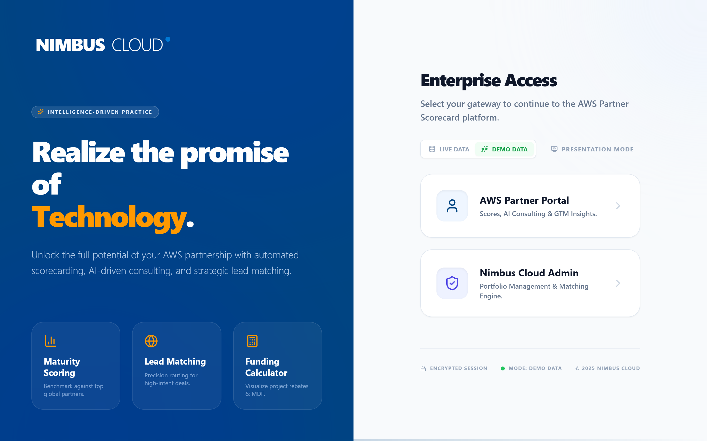
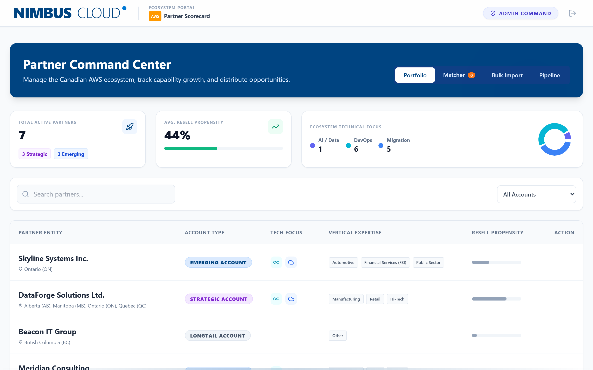
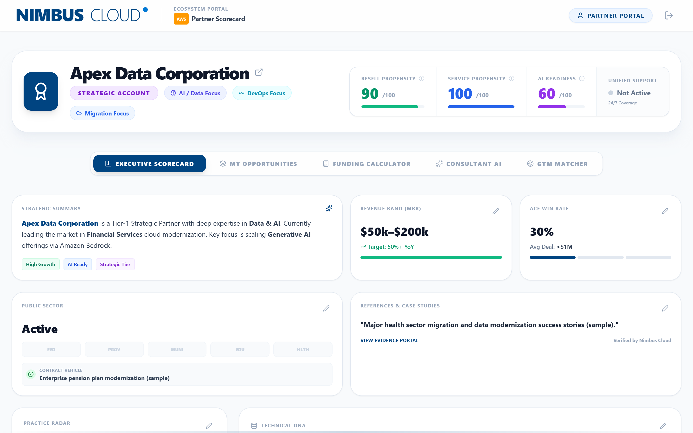
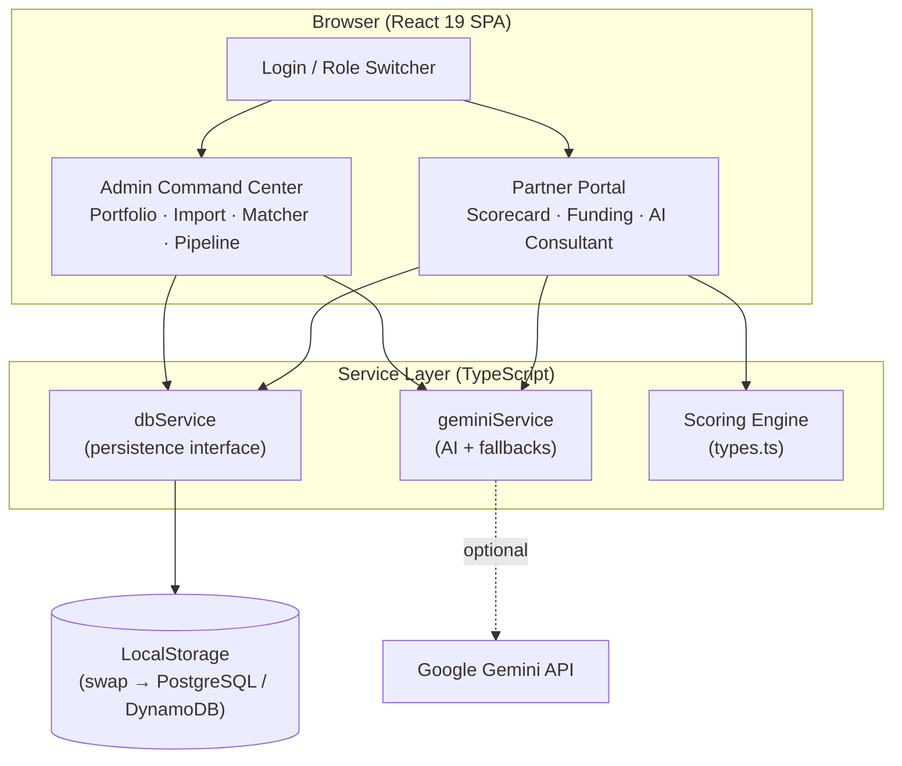

# Partner Intelligence Platform

> A full-stack portfolio project: an AI-powered ecosystem portal that digitizes cloud-partner assessment, funding optimization, and intelligent lead matching. Built around a fictional cloud distributor, **Nimbus Cloud**, managing its AWS partner network.

[](https://ashaw-studio.github.io/partner-intelligence-platform/)


**▶ Live demo:** https://ashaw-studio.github.io/partner-intelligence-platform/



---

## About This Project

This is a **personal portfolio demo** I built to showcase product thinking and full-stack engineering across a realistic B2B SaaS workflow: partner onboarding, scoring, AI-assisted consulting, and pipeline management.

> **All data is fictional.** Company names, contacts, emails, and phone numbers are invented for demonstration. Emails use the reserved `.example.com` domain and phone numbers use the reserved `555` range. Nothing in this repository represents a real organization, customer, or individual.

The domain — a distributor enabling cloud partners — is modeled on patterns common to the cloud channel (AWS partner programs like MAP, OLA, MDF, and ACE are publicly documented). It's a vehicle for demonstrating the engineering, not a representation of any specific company.

---

## The Problem It Solves

Managing a partner ecosystem is often manual, spreadsheet-heavy, and hard to scale:

- **No visibility** into partner technical maturity across regions
- **Missed funding** — partners don't know what programs they qualify for
- **Slow lead routing** — manually matching opportunities to the right partner takes hours
- **Relationship-based decisions** instead of data-driven ones

## The Solution

A single intelligence layer across the partner lifecycle:

| Capability | What It Does | Why It Matters |
|---|---|---|
| **Partner Scorecard** | 360° maturity assessment across Capability, Capacity, AI Readiness | Replaces subjective assessments with data |
| **Funding Calculator** | Instant funding estimates (MAP, OLA, POC, MDF) based on tier | Accelerates deal velocity |
| **AI Practice Consultant** | Context-aware chatbot that knows each partner's exact gaps | Enablement at scale, 24/7 |
| **Bulk Lead Ingestion** | CSV import with automatic parsing and partner detection | Minutes instead of days |
| **AI Opportunity Matcher** | Ranks top partner matches per lead with confidence scores | Data-driven routing |
| **Pipeline Governance** | End-to-end deal tracking from assignment through close | Full ecosystem visibility |

---

## Tech Stack

| Layer | Technology |
|---|---|
| **Frontend** | React 19, TypeScript, Tailwind CSS |
| **Build** | Vite 6 |
| **Charts** | Recharts |
| **AI** | Google Gemini (with graceful fallbacks when no key is configured) |
| **Server** | Express + Vite middleware (`server.ts`) |
| **Data** | LocalStorage (simulates a backend; designed to swap for a real DB) |

---

## Quick Start

### Prerequisites
- [Node.js](https://nodejs.org/) v18+
- (Optional) a [Google Gemini API Key](https://aistudio.google.com/apikey) — AI features fall back gracefully without one

### Setup
```bash
# Install dependencies
npm install

# (Optional) configure AI features
cp .env.example .env
# add your GEMINI_API_KEY to .env

# Start the dev server
npm run dev
```

Open **http://localhost:3000**.

> Without a Gemini API key, the AI Consultant and Opportunity Matcher use deterministic fallback responses. Every other feature works fully.

---

## Screenshots

| Admin Command Center | Partner Scorecard |
|---|---|
|  |  |

---

## Demo Walkthrough (10 minutes)

The app ships with **7 pre-seeded fictional partners** and sample lead data for a complete end-to-end demo.

### Phase 1 — Partner Experience
1. Select **"Partner Portal"** → **"Show Demo Users"** → choose **Apex Data Corporation**
2. **Executive Scorecard** — view the 360° maturity radar, certifications, AI readiness
3. **Funding Calculator** — select Migration, enter $500K ARR → instant funding breakdown
4. **AI Consultant** — ask *"How can I increase my AI readiness score?"* and watch it reference specific gaps

### Phase 2 — Admin Experience
1. Log out → select **"Nimbus Cloud Admin"**
2. **Portfolio** — browse all partners, filter by Track (A/B/C), search by name
3. **Bulk Import** → **"Load Live Sample"** → process the CSV → leads auto-distributed
4. **AI Matcher** → watch it analyze each unassigned lead and rank partner matches
5. **Approve matches** → verify in the **Pipeline** view

### Phase 3 — Closing the Loop
1. Log back in as the partner who received a lead
2. Move the opportunity to **"Closed Won"**
3. Switch to Admin → the deal appears as won in the master Pipeline

---

## How the Scoring Works

Partners are evaluated across three vectors (0–100 each):

| Score | Measures | Calculation |
|---|---|---|
| **Capability** | Technical depth & certifications | Competencies ×5 + service deliveries ×3 + public-sector bonus |
| **Capacity** | Ability to execute at scale | Team-size bands → score tiers |
| **AI Readiness** | GenAI maturity | 19-dimension matrix (0–5), normalized to 100 |

Partners are classified into **Tracks**: A (Foundational), B (Growth), C (Strategic).

### AI-Powered Matching
For each unassigned lead the matcher weighs capability alignment, track maturity, geographic proximity, and vertical overlap, then returns ranked matches with plain-English reasoning.

---

## Architecture



### File Layout

```
├── App.tsx                 # Root SPA — routing & state
├── components/
│   ├── AdminDashboard.tsx  # Portfolio, CSV import, AI matcher, pipeline
│   ├── Dashboard.tsx       # Partner scorecard, funding calc, opportunities
│   ├── IntakeWizard.tsx    # Multi-step partner assessment
│   ├── ChatBot.tsx         # AI Practice Consultant
│   ├── PartnerLogin.tsx    # Partner authentication (simulated)
│   └── Presentation.tsx    # Built-in guided presentation mode
├── services/
│   ├── dbService.ts        # Persistence layer (LocalStorage)
│   ├── geminiService.ts    # Google Gemini integration + fallbacks
│   ├── seedData.ts         # Fictional partner profiles
│   └── sampleLeads.ts      # Fictional lead dataset
├── types.ts                # TypeScript interfaces & constants
├── server.ts               # Express + Vite dev server
└── vite.config.ts          # Build configuration
```

---

## Demo Personas

Use the **"Show Demo Users"** dropdown on the Partner Portal login to sign in as any seeded partner. They span the full maturity range so you can see how scoring and recommendations adapt:

| Company (fictional) | Track | Profile |
|---|---|---|
| **Apex Data Corporation** | C — Strategic | Tier-1 Data & AI partner, large team, high readiness |
| **DataForge Solutions Ltd.** | C — Strategic | Strong data/analytics, scaling AI |
| **Northwind Innovations** | C — Strategic | Migration-focused, public sector |
| **Skyline Systems Inc.** | B — Growth | High-growth consultancy, early AI |
| **Summit Software Inc.** | B — Growth | ISV/SI with production AI workloads |
| **Meridian Consulting** | B — Growth | Mid-market MSP, building practice |
| **Beacon IT Group** | A — Foundational | New entrant, needs enablement |

For the admin view, log out and choose **"Nimbus Cloud Admin"**.

---

## Engineering Notes, Trade-offs & Roadmap

This is a focused demo, and a few decisions were made deliberately to keep it zero-setup and fully runnable offline. Each has a clear production path:

| Area | Demo Implementation | Why | Production Path |
|---|---|---|---|
| **Persistence** | Browser LocalStorage | No backend needed to demo end-to-end flows | `dbService` is intentionally DB-shaped — swap for PostgreSQL/DynamoDB behind the same interface |
| **AI key** | Gemini key read client-side at build | Keeps the demo self-contained | Move AI calls behind a serverless proxy so the key never reaches the browser |
| **Auth** | Simulated persona switcher | Lets reviewers explore both roles instantly | Real SSO / OAuth (e.g., Cognito) with RBAC |
| **Styling** | Tailwind via CDN | Fast iteration, no build step for styles | Compile Tailwind through PostCSS for tree-shaking and CSP compliance |
| **Bundle** | Single chunk (~250 KB gzip) | Acceptable for a demo SPA | Route-level code-splitting via dynamic `import()` |
| **AI resilience** | Deterministic fallbacks when no key/timeout | App stays fully demoable offline | Same pattern + retries/observability in production |

> The point of these notes is to show the reasoning, not to hide the gaps — the architecture was built so each demo shortcut has a one-step swap to a production-grade component.

---

## License

MIT — see [LICENSE](./LICENSE). Built as a personal portfolio project; all data is fictional.
